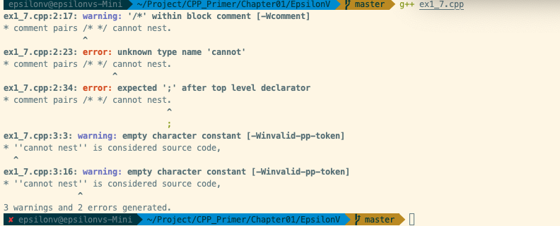

# Note

[note](./note.md)

# Exercise

## 1.2

echo $? ⇒ 255 

请看[这里](http://www.tldp.org/LDP/abs/html/exitcodes.html)

## 1.6

不合法, 修改如下:

    std::cout << "The sum of " << v1 << " and " << v2 << " is " << v1 + v2 << std::endl;

## 1.7

输出如下:

## 1.8

    std::cout << "/*";
    std::cout << "*/";
    std::cout << /* "*/" */;   不合法 少一个 ' " '
    std::cout << /* "*/" /* "/*" */;

## 1.12

for循环完成了从-100 累加到100， sum的值为0.

## 1.13

    //ex1.9
    #include <iostream>
    int main() {
    	int sum = 0;
    	for(int i = 50; i < 100; i++)
    			sum += i;
    	std::cout << "The sum is " << sum << std::endl;
    
    	return 0;
    }
    
    //ex1.10
    #include <iostream>
    
    int main(){
       for(int i = 10; i > 0; i--)
          std::cout << i << std::endl;
    
    	return 0;
    }
    
    //ex1.11
    #include <iostream>
    
    int main(){
       std::cout << "Please enter two number:" << std::endl;
       int v1 = 0, v2 = 0, temp;
    	 std::cin >> v1 >> v2;
    
    	 if (v1 < v2) {
          temp = v1;
          v1 = v2;
          v2 = temp;	 
    	 }
    
       for (int i = v2; i < v1; i++) {
    	   std::cout << i << std::endl;
       }
    
    	 return 0;
    }

## 1.14

参考[Stack Overflow](https://stackoverflow.com/questions/2950931/for-vs-while-in-c-programming)

## 1.17

如果输入都是相等的，程序将会打印一行。

如果输入都是不等的，程序会将所有输入值都打印出来。