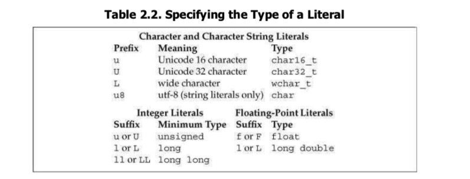

# 第二章 C++基础

1. 当赋给  `short`  一个超过它表示范围的值时，结果是初始值对无符号类型表示数值总数取模后的值   unsigned char a = -1  如果char 占8bit, a的值为255.

       当赋给带符号类型一个超过它表示范围的值时，结果是未定义的。

 2. 

3. 列表初始化, 使用列表初始化，如果存在信息丢失，编译器会报错。初始化每一个内置类型的变量。

    int units_sold = 0;
    int units_sold = {0};
    int units_sold(0);
    int units_sold{0};
    
    long double ld = 3.14;
    int a{ld}, b = {ld};  //error
    int c(ld), d = ld;  //correct

4. **声明**使得名字为程序所知，一个文件若想用别处定义的变量，必须包含该变量的声明。**定义**负责创建对应的实体，将分配空间，还可能会给变量赋一个初始值。如果只想声明一个变量而非定义它，在变量前面添加关键字extern， 任何包括了显示初始化的声明即成为定义.

    extern int i; 声明i而非定义i
    int j; 声明并定义j;
    extern int c = 0; 定义

5. 引用必须初始化，并非对象，它只是给已存在的对象起的别名。为引用赋值，相当于把值赋给了与引用绑定的对象。引用对象的初始值必须要是一个对象， 且类型需要和绑定对象一至。

    int ival = 1024;
    int &refVal = ival; //refval 指向ival
    int &refVal2; //错误 需初始化
    int &refVal3 = refVal; //refVal3 绑定到ival
    int &refVal4 = 0; //错误 初始值必须是对象

6. 指针是一个对象，引用不是对象，没有实际地址，不能定义指向引用的指针。空指针的初始化最直接的方式是通过字面值 `nullptr` 来初始化。NULL(预处理变量 定义在cstdlib)也可以给指针赋值。

7.默认状态下，`const` 对象仅在文件内有效。为了在多个文件中共享同一个 `const`  变量，不管在声明还是定义的时候都添加 `extern` 关键字。

    //file_1.cc 定义并初始化一个常量
    extern const int bufsize = 1024;
    //file_1.h 头文件
    extern const int bufsize; //于file_1.cc 定义的是同一个

将引用绑定到const 对象上，称之为对常量的引用。对常量的引用不能被用作修改它所绑定的对象

    const int ci = 1024;
    const int &r1 = ci;
    r1 = 42; //错误
    int &r2 = ci; //错误 非常量引用不能指向一个常量 应为非常量引用可能会修改绑定的对象。

在初始化常量引用时允许任意表达式作为初始值，只要该表达式的结果能够转化成引用的类型。允许一个常量引用绑定非常量的对象

    int i = 42;
    const int &r1 = i;
    const int &r2 = 42;
    const int &r3 = r1 * 2;
    int &r4 = r1 * 2; //错误

8 指针和const **指向常量的指针**不能用于改变其所指对象的值，要想存放常量对象的地址， 只能使用指向常量的指针，允许一个指向常量的指针指向一个非常量对象。和常量引用一样， 指向常量的指针没有规定指向的对象必须是一个常量，指向常量的指针仅仅要求不能通过该指针改变对象的值，而没有规定那个对象的值不能通过其他途径改变。

**const 指针** 指针是对象，所以可以把指针本身定位常量。常量指针必须初始化，一旦初始化完成，存放在指针中的地址就不能再改变了，就不能指向其他变量了。

    int errNumb = 0;
    int *const curErr = &errNumb; //curErr 将一直指向errNumb
    const double pi = 3.14;
    const double *const pip = &pi; //pip是一个指向常量对象的常量指针

9. **顶层 `const`** 表示指针本身是个常量，**底层 `const`** 表示指针所指的对象是一个常量。

10. 常量表达式是指值不会改变并且编译过程就能得到计算结果的表达式，字面值属于常量表达式，用常量表达式初始化的 `const` 对象也是常量表达式。

c++11 允许将变量声明为 `constexpr` 类型以便编译器来验证变量的值是否是一个常量表达式，声明为 `constexpr` 的变量一定是常量，而且必须使用常量表达式初始化。
