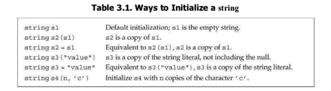
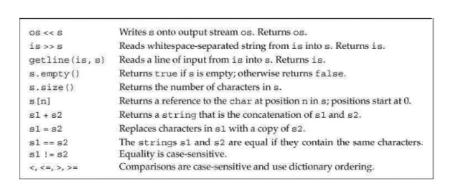
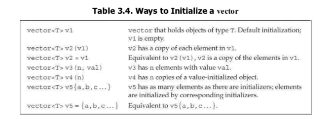
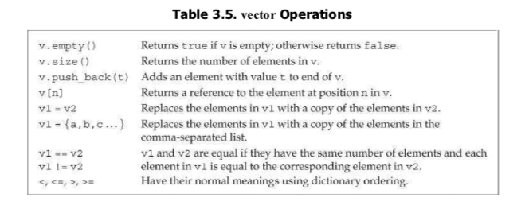
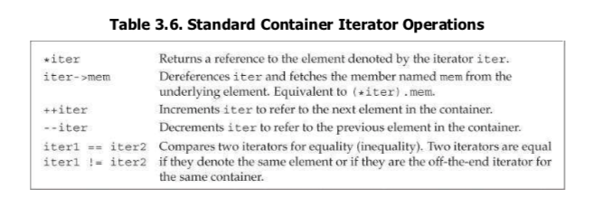
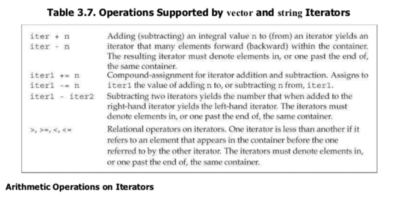

# 第三章 字符串 向量和数组

1. `unsing namespace::name;` 头文件不应该包含using声明。
2. 标准库类型 `string` 表示可变长的字符序列，定义在命名空间`std`中。
3. 初始化

      使用等号(=)初始化一个变量，执行的是拷贝初始化(copy initialization), 编译器把等号右侧的初始值拷贝到新创建的对象中去。如果不用等号，执行的是直接初始化(direct initialization).
    
    string s5 = "hiya";  //拷贝初始化
    string s6("hiya");   //直接初始化
    string s7(10, 'c');  //直接初始化
    string s8 = string(10, 'c');  //拷贝初始化，创建临时对象用于拷贝

4.  string operations

      在执行读取操作时(is >> s), string 对象会自动忽略开头的空白(空格符 换行符 制表符)并从第一个真正的字符开始读起，直到遇见下一处空白。和内置类型的输入输出一样，string 类型也是返回运算符左侧的运算对象作为结果，因此多个输入和输出可以连写。
    
    string s1, s2;
    cin >> s1 >> s2;
    cout << s1 << s2 << endl;

5. string 的getline 读取一整行，直到遇到换行符结束读取(换行符也被读进来了), 然后将所读的内容存入那个string 对象中去(不包括换行符)

6.vector 表示对象的集合，所有的对象的类型必须相同。使用索引访问对象，又被称为容器(container). vector 是一个类模板，模板不是类或函数，可以将模板看成作为编译器生成类或函数编写的一份说明。

    template < class T, class Alloc = allocator<T> > class vector; // generic template

如果vector 对象中的元素不支持默认初始化，必须提供初始的元素值。

7 Iterator

C++ 常用迭代器而非下标，以及在for 中使用 `!=`   而非 <,这种编程风格在标准库提供的所有容器都有效。

8. 数组的声明为a[d]; a为数组名，d是数组的维度，维度必须是一个常量表达式。且定义类型时不允许使用auto关键字由初始化值得列表推断类型。
